# GPT Model Deconstruction

This repository is a scientific, code-free companion page for a complete notebook implementation of GPT-style language models. The project deconstructs the architecture from first principles: token embeddings, positional embeddings, layer normalization, causal self-attention, residual transformer blocks, multi-head attention, a larger GPT-like model, and finally the original pretrained GPT-2 architecture.

Full implementation: [gpt_model_dec.ipynb](./gpt_model_dec.ipynb)

The notebook contains all executable code, intermediate tensor inspections, generated outputs, and model introspection. This README summarizes the notebook content and presents the extracted plots without reproducing implementation code.

## Abstract

The goal of this project is to make the internal mechanics of GPT-style autoregressive language models explicit and inspectable. Instead of treating GPT as a black box, the notebook builds progressively from a single attention head to a multi-block, multi-head transformer and then compares the constructed components with Hugging Face's pretrained GPT-2. Each section records tensor shapes, architectural decisions, visual diagnostics, and generation behavior.

The central object of study is causal scaled dot-product attention:

$$
Q = XW_Q,\quad K = XW_K,\quad V = XW_V
$$

$$
A = \operatorname{softmax}\left(\frac{QK^\top}{\sqrt{d_k}} + M\right)
$$

$$
H = AV
$$

where the causal mask prevents each token position from attending to future positions:

$$
M_{ij} =
\begin{cases}
0, & j \le i \\
-\infty, & j > i
\end{cases}
$$

## Repository Contents

| Path | Description |
| --- | --- |
| [gpt_model_dec.ipynb](./gpt_model_dec.ipynb) | Complete notebook implementation with code, explanations, plots, outputs, and GPT-2 inspection |
| [README.md](./README.md) | Professional overview of the notebook without code |
| [figures/](./figures/) | Extracted visual outputs used in this README |

## Notebook Structure

| Section | Topic | Scientific purpose |
| --- | --- | --- |
| Model 0 | One attention head | Isolates embeddings, normalization, Q/K/V projection, causal masking, attention weights, value mixing, output projection, and sampling |
| Model 1 | Full transformer block | Adds residual connections, pre-normalization, MLP expansion, GELU nonlinearity, and vocabulary projection |
| Model 2 | Multiple transformer blocks | Studies representation changes across a 12-block residual stack |
| Model 3 | Multi-head attention | Splits the embedding representation into independent attention subspaces and recombines them |
| Model 4 | Full GPT-style model | Scales the implementation to GPT-like dimensions and compares CPU/GPU placement and generation cost |
| Model 5 | Original GPT-2 inspection | Loads pretrained GPT-2 and inspects embeddings, transformer blocks, parameters, and sampled generation |

## Main Results

| Area | Result |
| --- | --- |
| Embedding pipeline | Token ids become dense token embeddings, positional vectors are added, and the residual stream keeps shape `[batch_size, sequence_length, embedding_dim]` |
| Layer normalization | Normalization stabilizes each token representation across the embedding dimension before attention or MLP updates |
| Q/K/V projections | Query, key, and value projections preserve batch and sequence axes while rewriting each token into attention-specific representations |
| Causal masking | Replacing future-token scores with negative infinity produces zero probability after softmax |
| Attention output | Attention weights mix value vectors into contextual token representations while preserving model dimensionality |
| Transformer block | Attention and MLP branches update the residual stream without replacing it |
| Transformer depth | Sequential blocks preserve tensor shape while gradually changing hidden representations |
| Multi-head attention | `embed_dim = 256` is partitioned into `num_heads = 8` and `head_dim = 32`, enabling multiple attention subspaces |
| GPT-like scaling | The larger model uses `embed_dim = 768`, context length `1024`, and GPT-2 vocabulary size `50257` |
| GPT-2 comparison | The pretrained GPT-2 model contains 12 transformer blocks, token embeddings of shape `[50257, 768]`, and positional embeddings of shape `[1024, 768]` |

## Captured Notebook Outputs

| Notebook output | Captured observation |
| --- | --- |
| Tokenizer loading | Hugging Face GPT-2 tokenizer loads successfully; unauthenticated Hub warnings may appear |
| Parameter inspection | The notebook prints embedding matrices, LayerNorm parameters, attention projections, output projections, and vocabulary projection weights |
| Softmax masking test | Softmax over a finite masked value still assigns probability, while negative infinity removes future-token probability |
| Model 0 generation | An untrained one-head model samples a continuation from the prompt `I believe I can fly, I believe` |
| Model 1 generation | An untrained transformer block samples a continuation from `Love me tender, Love me sweet. Never let` |
| Model 2 generation | A 12-block untrained transformer produces noisy, repetitive text, showing that architecture alone is not learned language |
| Model 3 generation | The untrained multi-head model shows similar random sampling behavior |
| Model 4 timing | The captured CPU run takes roughly three minutes for the configured long-context generation |
| GPT-2 loading | Pretrained GPT-2 loads with the expected Hugging Face module structure |
| GPT-2 generation | The pretrained model produces coherent English continuation from the prompt `Hello, how are you today?` |

## Visual Results

The following figures are extracted from the notebook and grouped by the part of the architecture they explain.

### Embeddings, Normalization, and Attention

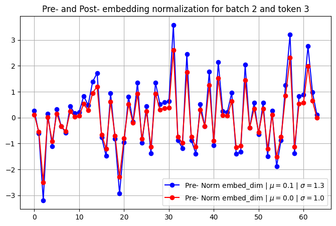

Layer normalization changes token-level embedding distributions toward zero mean and unit variance.

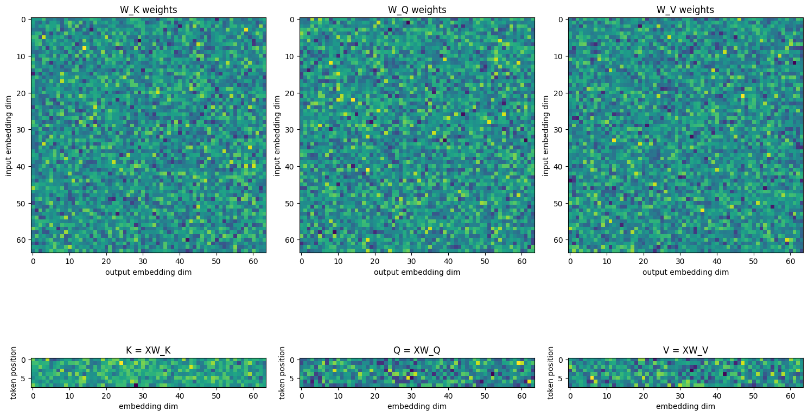

The Q, K, and V projections preserve batch and sequence dimensions while changing the representation space used by attention.

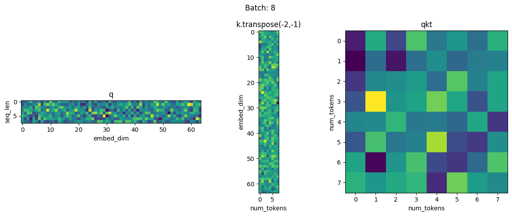

Raw dot-product attention scores show token-to-token compatibility before scaling and masking.

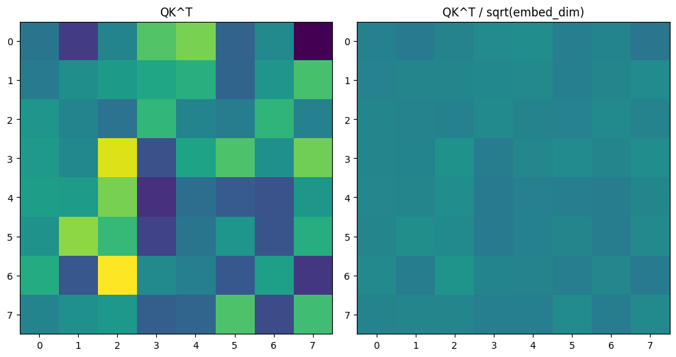

Scaling by the square root of the key dimension prevents large dot products from making the softmax distribution too sharp.

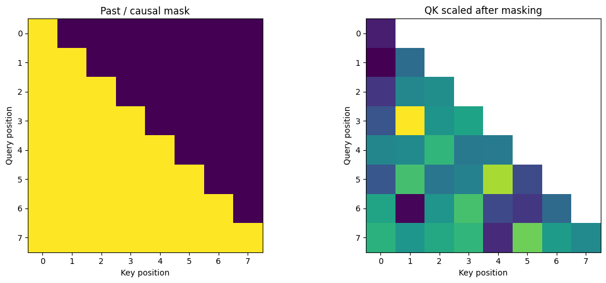

The causal mask preserves access to current and previous positions while blocking future positions.

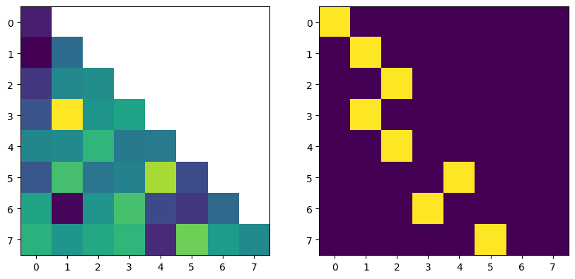

After masking and softmax, each token receives a probability distribution over valid previous positions.

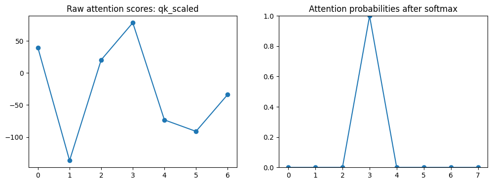

A selected token position can attend only to tokens that are causally visible.

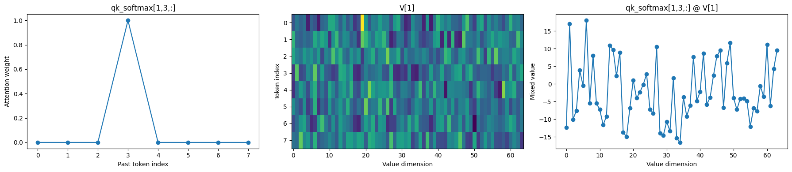

Attention weights mix value vectors into a contextual representation for each token.

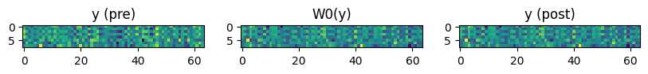

The output projection rewrites the attention result back into the model's residual stream.

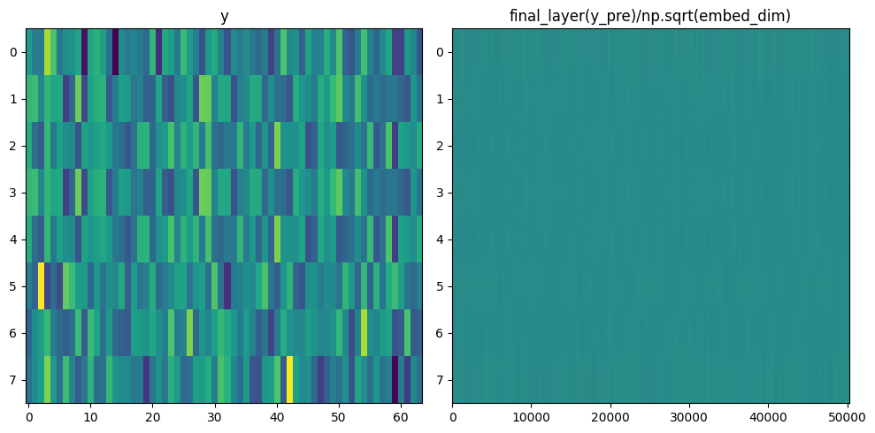

The final projection maps hidden states to vocabulary logits.

### Generation and Sampling

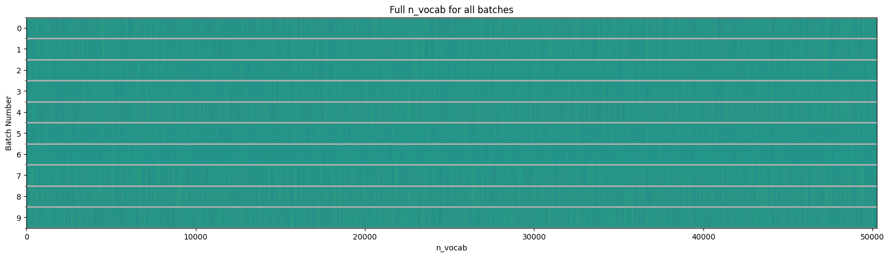

Autoregressive generation uses the final sequence position to predict the next token.

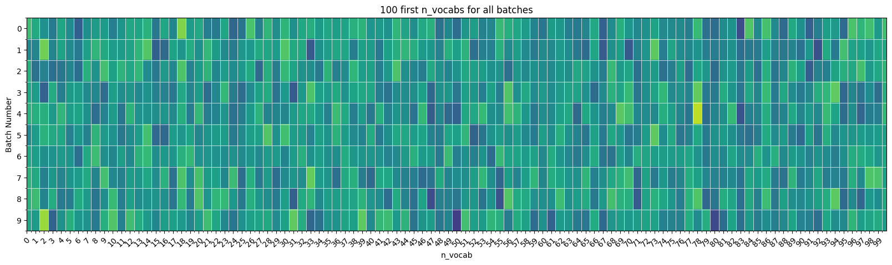

The selected final-position logits define the distribution used for next-token sampling.

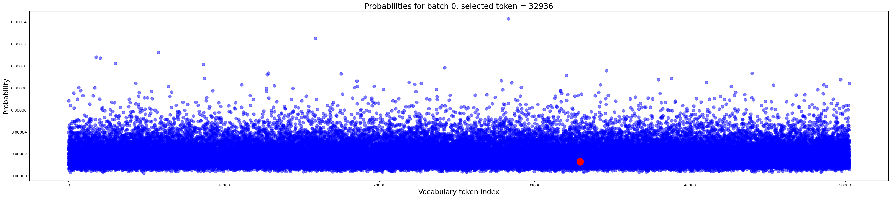

Higher temperature spreads probability mass across more candidate tokens.

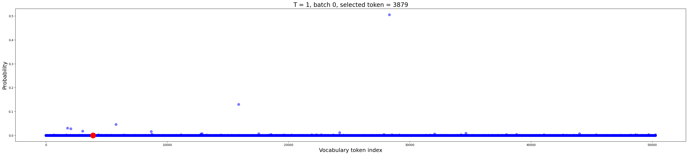

Lower temperature concentrates probability mass around the highest-scoring tokens.

### Transformer Block and MLP

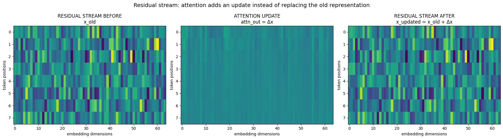

The attention branch updates the residual stream while preserving tensor shape.

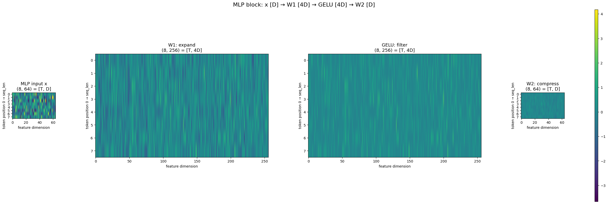

The MLP expands the representation into a higher-dimensional feature space before contraction.

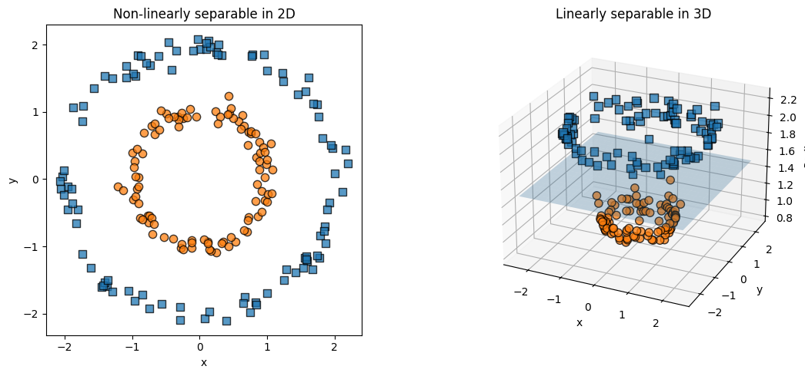

The notebook uses a geometric example to illustrate how higher-dimensional features can make separation easier.

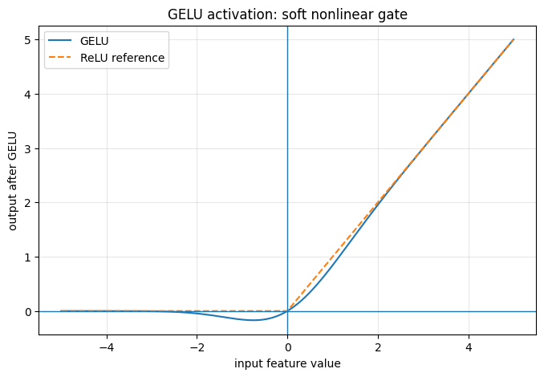

GELU introduces nonlinearity between the MLP expansion and contraction layers.

### Depth and Multi-Head Attention

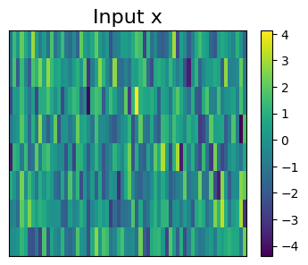

A single transformer block changes hidden representations while keeping the residual-stream shape fixed.

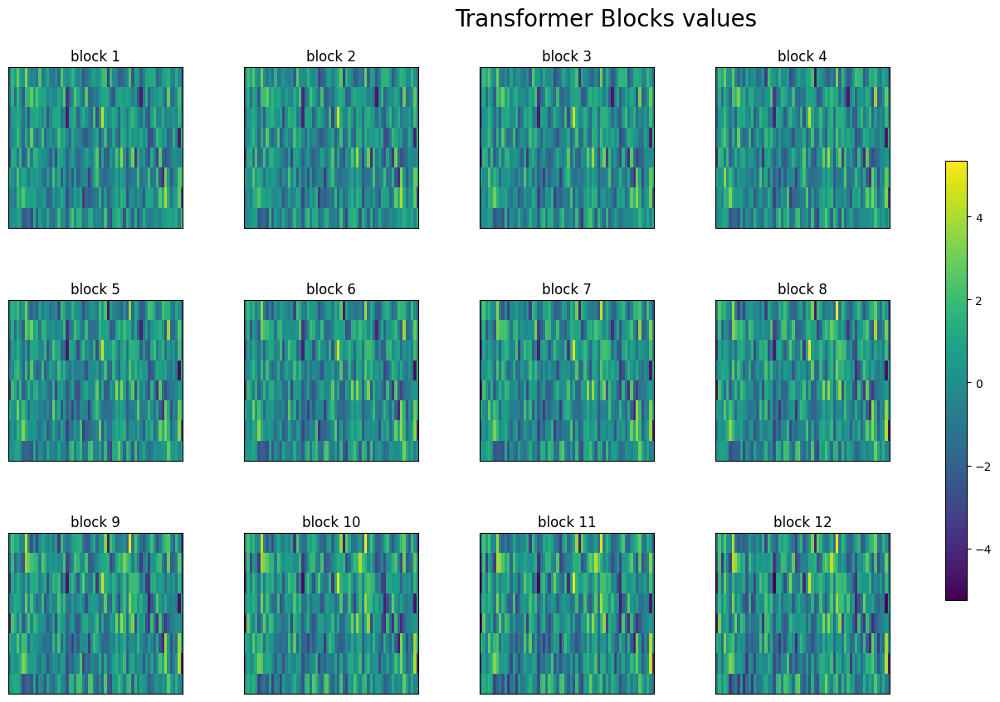

Stacked transformer blocks progressively transform the residual stream.

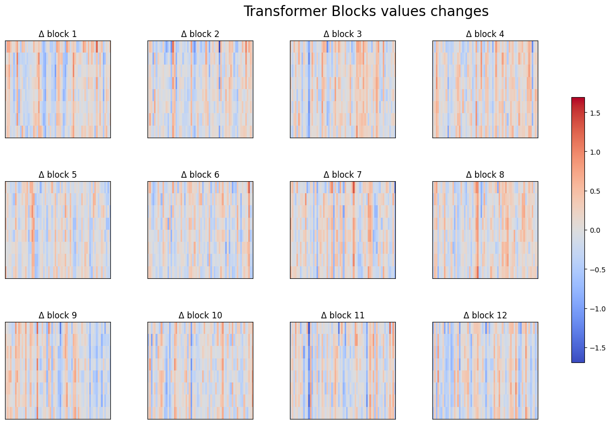

Differences between consecutive blocks reveal incremental residual updates across depth.

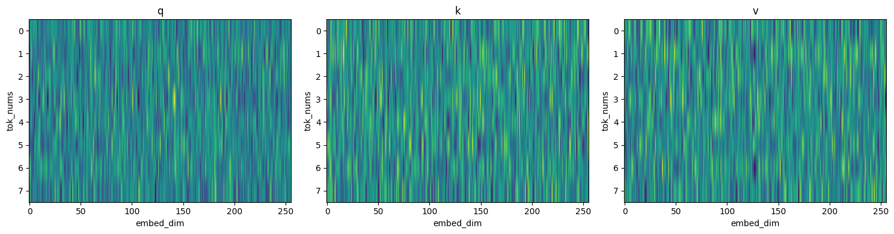

Before multi-head reshaping, Q, K, and V live in the full embedding dimension.

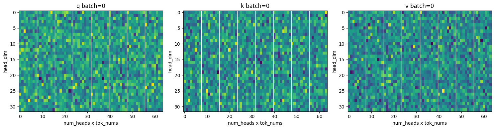

After reshaping, each attention head receives a smaller feature subspace.

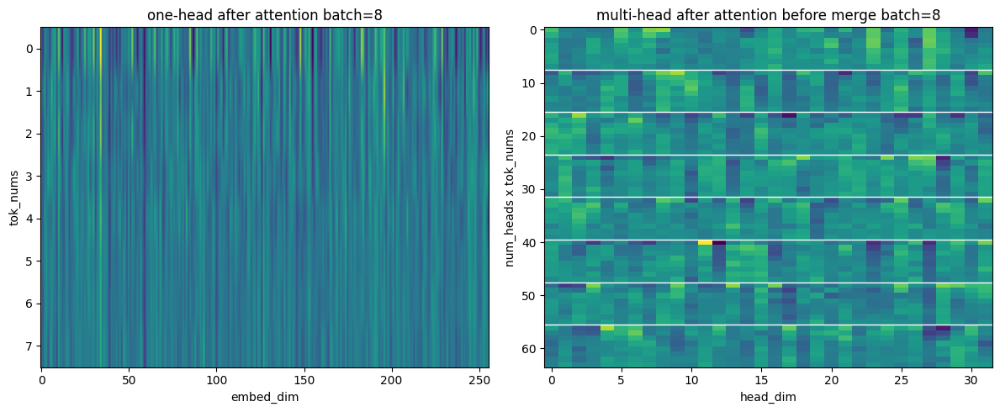

Independent attention heads are merged back into a single embedding representation.

## Technical Notes

The notebook has been normalized for GitHub rendering: large widget state metadata and Colab-specific widget outputs were removed while preserving notebook cells, text outputs, image outputs, and the extracted figures used by this README.

For the complete executable implementation, open [gpt_model_dec.ipynb](./gpt_model_dec.ipynb).
